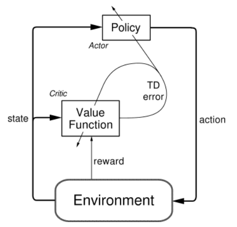
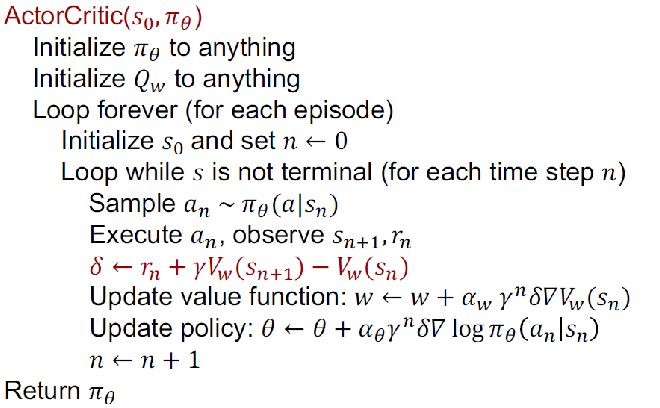

<h1>Music Recommendation System</h1>

Our recommendation system is a project that leverages the deep reinforcement learning for the purpose of understanding the user preferences. Here, the preference that we need to consider is if the user skips or listens the song. Here, the Deep Deterministic Policy Gradient(DDPG) algorithm which is a model-free reinforcement learning(RL) method in addition with tensorflow.

<h6>Deep Deterministic Policy Gradient</h6>
Deep Deterministic Policy Gradient(DDPG) is a model-free off-policy algorithm for learning a series of continous actions. This algorithm is the combination of Deterministic Policy Gradient(DPG) and Deep Q-Network(DQN) operating over the continous action spaces.

<h6>Actor-Critic</h6>
The DDPG agent is an actor-critic RL agent that determines an optimal policy for maximizing the expected reward. Actor-Critic method is a temporal difference method that has a separate memory structure for representing the policy independent of the value function. Here the policy is considered the actor, it is used to select actions. On the other hand, the estimated value function (Q-value) is the critic that criticizes the actions of the actor.

    

<h6>Tensorflow</h6>
TensorFlow is a free and open-source software library for machine learning and artificial intelligence. It can be used across a range of tasks but has a particular focus on training and inference of deep neural networks.

<h3>Model</h3>
In our model, we have adopted the DDPG algorithm that learns a policy and the Q-function concurrently. The DDPG has been integrated with the actor-critic schema for the sequential interactions between the users and the system. The user is recommended the songs which has the three highest scores based on the songs the user has been listening in a particular period, the actor network takes the song's enbedding features which is built into a policy function for scoring the all songs that are available. After that the critic network utilizes the approximation in order to learn the Q-function that determines if the selected song matches the user behavior at current state. Finally, the actor network updates its parameters based on the judgements from the critic network in order to improve the performance for rest of the iterations.

    

